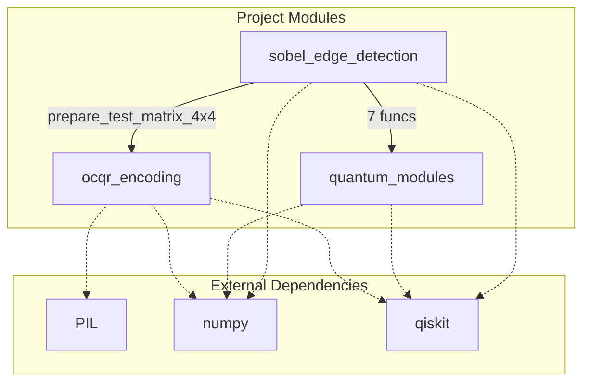

# Code Map

> For rendering Mermaid diagrams, install the **"Markdown Preview Mermaid Support"** VS Code extension.

## Dependency Diagram

## Module Summary

| File | Functions | Local Deps | External Deps |
|------|----------|------------|---------------|
| `helpers/ocqr_encoding.py` | 7 | — | PIL, numpy, qiskit |
| `helpers/quantum_modules.py` | 16 | — | numpy, qiskit |
| `helpers/sobel_edge_detection.py` | 8 | quantum_modules(quantum_adder, quantum_cloning_module, quantum_comparator, quantum_max_value_module, quantum_subtractor, quantum_swap, quantum_threshold_module), ocqr_encoding(prepare_test_matrix_4x4) | numpy, qiskit |

## Function Reference

### ocqr_encoding

| Function | Description |
|----------|-------------|
| `encode_ocqr_from_matrix` | Encodes a classical RGB matrix into the OCQR quantum representation. |
| `encode_ocqr_from_image` | Encode a classical image file into OCQR quantum representation. |
| `prepare_test_matrix_4x4` | Creates the 4x4 test matrix from Figure 1 and Figure 15 of the paper. |
| `prepare_neighborhood_images` | Prepares the eight-neighborhood images as shown in Figure 2 of the paper. |
| `encode_ocqr_with_neighborhoods` | Encodes the original image and its 8 neighborhoods for edge detection. |
| `decode_ocqr_to_classical` | Decodes quantum measurement results back to classical image format. |
| `visualize_ocqr_encoding_example` | Demonstrates the OCQR encoding process with the 4x4 test matrix. |
### quantum_modules

| Function | Description |
|----------|-------------|
| `quantum_cloning_module` | Quantum Cloning Module (Fig. 5) |
| `quantum_adder` | Quantum Adder Module (Fig. 6) |
| `quantum_subtractor` | Quantum Subtractor Module (Fig. 7) |
| `quantum_comparator` | Quantum Comparator Module (Fig. 8) |
| `quantum_swap` | Quantum Swap Module (Fig. 9) |
| `quantum_max_value_module` | Maximum Value Calculation Module (Fig. 10) |
| `quantum_threshold_module` | Quantum Threshold Module (Fig. 11) |
| `quantum_gradient_module` | Edge Gradient Calculation Module (Fig. 13) |
| `quantum_cloning_module_for_circuits` | Implement quantum cloning module circuit as shown in Fig. 5 of the paper. |
| `quantum_adder_module_for_circuits` | Implement quantum adder module circuit as shown in Fig. 6 of the paper. |
| `quantum_subtractor_module_for_circuits` | Implement quantum subtractor module circuit as shown in Fig. 7 of the paper. |
| `quantum_comparator_module_for_circuits` | Implement quantum comparator module circuit as shown in Fig. 8 of the paper. |
| `quantum_swap_module_for_circuits` | Implement quantum-controlled swap module circuit as shown in Fig. 9 of the paper. |
| `quantum_max_value_module_for_circuits` | Implement maximum value calculation module circuit as shown in Fig. 10 of the paper. |
| `quantum_threshold_module_for_circuits` | Implement quantum threshold module circuit as shown in Fig. 11 of the paper. |
| `quantum_edge_detection_circuit_for_circuits` | Implement the complete edge detection circuit as shown in Fig. 14 of the paper. |
### sobel_edge_detection

| Function | Description |
|----------|-------------|
| `classical_sobel_gradients` | Classical implementation of the improved Sobel operator for verification. |
| `quantum_gradient_calculation_single_pixel` | Quantum calculation of gradients for a single pixel and its 3x3 neighborhood. |
| `quantum_gradient_module` | Complete gradient calculation module (Fig. 13). |
| `quantum_max_value_and_threshold` | Combined maximum value calculation and threshold operation. |
| `quantum_edge_detection_complete` | Complete edge detection circuit (Fig. 14). |
| `classical_edge_detection` | Classical edge detection for comparison with quantum results. |
| `test_sobel_on_paper_matrix` | Test the Sobel edge detection on the 4x4 matrix from the paper. |
| `create_quantum_sobel_circuit_placeholder` | Creates a placeholder for the complete quantum Sobel circuit. |

---
*Auto-generated by `python codemaps.py`*
